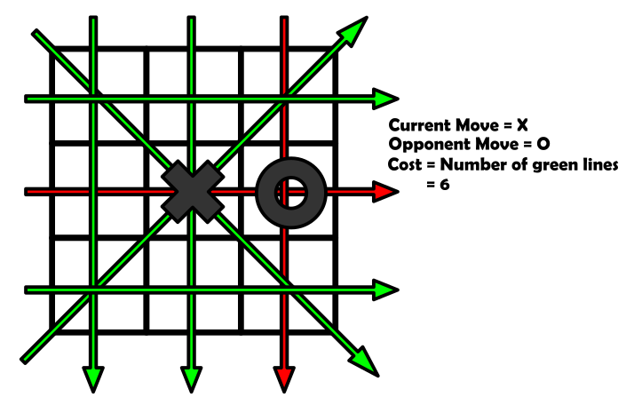
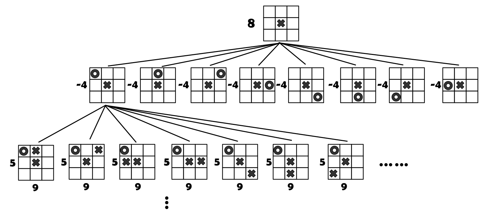
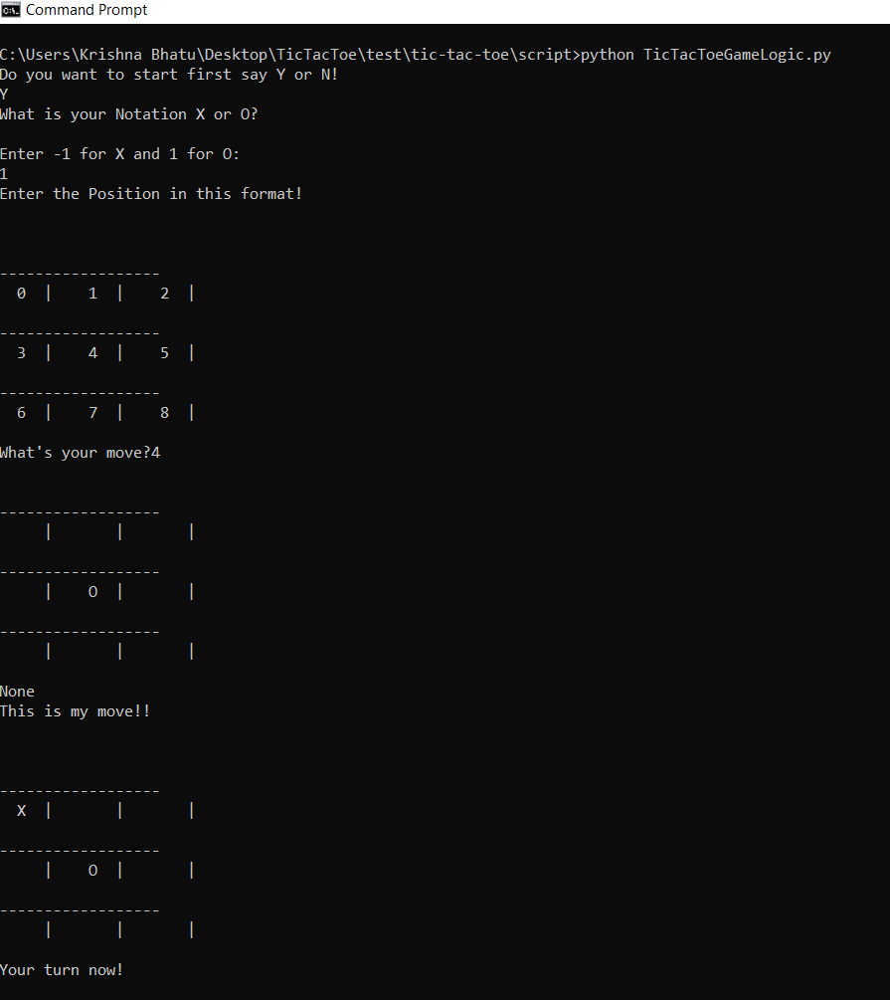

# Tic-Tac-Toe
YOU CAN PLAY BUT YOU CAN NEVER WIN.

## Personnel

  - Krishna Bhatu (kbhatu@terpmail.umd.edu): A student of Masters in Robotics Engineering at the University of Maryland, College Park. My area of interest is computer vision, machine learning and aerial robotics.

## Project Description

This is a tic-tac-toe game playing software written in python language. It uses the Tree data structure to determine each move on the tic-tac-toe board as a node. The move that was played before that is the parent node in the tree and the possible moves that can be derived from it are the children nodes. For ensuring the winning condition of the computer, cost function is used which has to be maximized in order to play the best move. Thus, the software looks for the 4 moves ahead of the current position of board and calculates the higest cost and determines the move. By using this the human player can never win the game. The best case for the human challanger is a draw.

## Project Modules

  - Cost Function:
  

  
  

  The cost of the node is calculated in such a way that it determines the number of possible ways for the software to win. The maximum number value of the cost function is 8 (Possibile winning condition in 3 rows, 3 columns and 2 diagonals). As we can see in the image that the number of green lines are the possible winning condition for the current move which is 'X'. The red lines are the conditions where the player with 'X' cannot win because there is already a 'O' in the way of the winning condition. Hence, the cost of that node is 6.
  
  - Tree and Total Cost:
  

  
  

   As every board position is given by a node with the attributes like board position, parent node, child nodes and cost. This structure allows the software to explore all the possible moves that can be played by both the payers and with the help of this structure it is possible to determine which path should the software take to win the game. The above image shows the tree expanding with the root node as the first move played by player with 'X'.
   Also the node selection is done by the total cost after 4 future moves. For the given image the node is expanded only for 3 moves. The total cost is calculated using the cost function of each node, for the best move we need to maximize the total cost function. But at the same time we need to reduce the cost of the opposition player. So, the total cost is calculated by adding all the cost function values with the same move(like 'X' in this case) and subtracting all the cost function values with the opposition move(like 'O' in this case).
   
## Development using Solo Iterative Process (SIP) and Test-Driven Development (TDD)

In this project, a solo-iterative process is used where first the product backlog is created. Then the highest priority requirements are selected and assigned at the top of the TODO task. In the project backlog, estimated time of completion was allotted to every task. Actual time of completion was compared with the estimated time and based on that, the time allotement of the future tasks is modified.

After the planning is done, the UML flow diagram and the UML class diagram of the software are developed. Based on the UML diagrams the unit test classes are written. Then the stub classes are written with the functions matching the test cases. Thus the coverage of the software is maintained.

Following is the link to the spreadsheet that contains the detailed entries of the product backlog, time log, error log and release backlog [link](https://docs.google.com/spreadsheets/d/189605Gkb5U7Paj4SMtSJwzeGhh7_i7DxscVkopkX0Qg/edit?usp=sharing)

## Dependencies

  - Python 2.7
  - unittest
  - coverage
  - coveralls
  - Numpy
  
## Installation

For installing Python use the following [link](https://www.python.org/download/releases/2.7/)

The detailed explaination of installing python, pip and setting up the path for the environmental variable are given in the following [link](https://github.com/BurntSushi/nfldb/wiki/Python-&-pip-Windows-installation)

For rest of the installations(numpy, unittest, coveralls, coverage) open the command prompt and type the following commands;
'''
pip install <package name>
'''

## Run Instructions

For running the software the first setp is to clone the repository at your local machine, this can be done by typing the following command on your command prompt.
'''
git clone https://github.com/KrishnaBhatu/tic-tac-toe.git
'''

For running the software:
'''
cd <path to the repository>
cd script
python TicTacToeGameLogic.py
'''
This will open up an interractive terminal where you can play a game of tic tac toe with the computer.(WARNING: You can never win against this software).
Following is the screenshot of the output.

## Documentation

The commenting for the software is done in the doxygen format. To view the documentation of software we need to install doxygen.
 
 For Windows:
 Go to the following link to download the setup.exe file for doxygen [link](http://www.doxygen.nl/download.html)
 
 For Ubuntu:
 Type the following command on the terminal
 '''
 sudo apt-get install doxygen
 sudo apt-get install doxygen-gui
 '''
Now to view the documentation you need to open up the doxywizard which is the doxygen GUI.
Add the details of the project including title(Tic-Tac-Toe Game), description and version. Select your script directory as the source directory and create a new directory at the location of your choice and set it as the destination directory. 
Click Next, now select all entreis and optimize for C++.Click Next, now set the output formats to both HTML and LaTex.Click Next, now chose build in generator and click next. Now select the reopsitory folder as the folder for the doxygen to run and run doxygen. After the run is complete, you can view the HTML document. Also the HTML and LatTex files will be stored in the destination folder.  

## Code Coverage

The coverage can be looked at the coverage badge on the top of readme file. The coverage is 86% but if not updated then click on that badge and you will be directed to the coveralls page where the coverage can be checked. The missing 14% coverage is about the printMe() function in the TicTacToeClass which is just for the user interraction.
